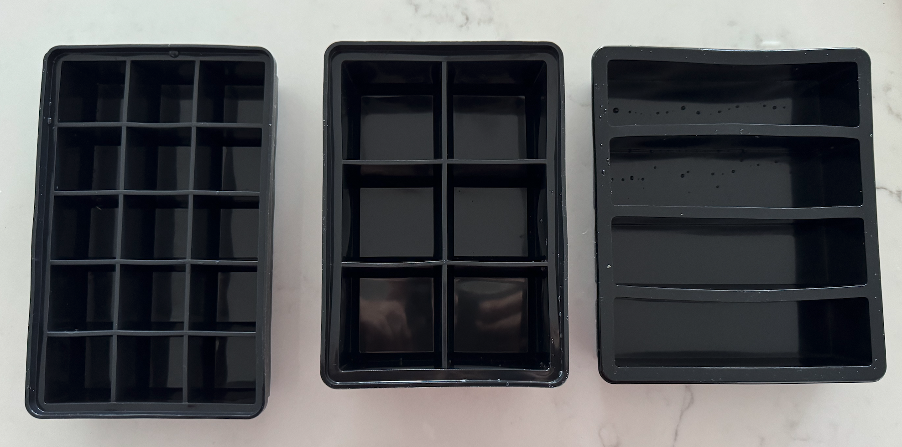

# Bread

## Equipment

### Capacities

* Big bread tin = 3850ml
* Small bread tin = 2800ml
* Machine tin = 3420ml

### Volumes

#### All Four

To make bread for all four tins (two big + two small):

* 1820g flour
* 1440g water
* 38.4g bread improver
* 38.4g salt
* 38.4g corn starch
* 28.8g yeast

This will produce around 3400g dough, of which:

* 985g dough per big tin
* 715g dough per small tin

#### Per Big Tin

* 530g flour
* 420g water
* 11.2g bread improver
* 11.2g salt
* 11.2g corn starch
* 8.4g yeast

#### Per Small Tin

* 380g flour
* 300g water
* 8g bread improver
* 8g salt
* 8g corn starch
* 6g yeast

# Sauce

## Equipment

### Capacities

* Long ice-cube slots = 150ml
* Big ice-cubes = 100ml
* Small ice-cubes = 33ml (~2 tablespoons)

*From left to right: small (33ml); large (100ml); long (150ml)*
